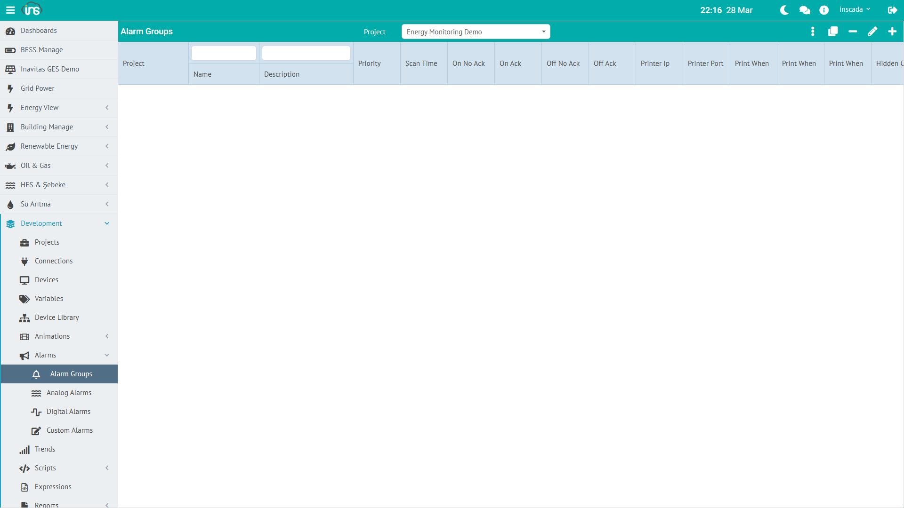
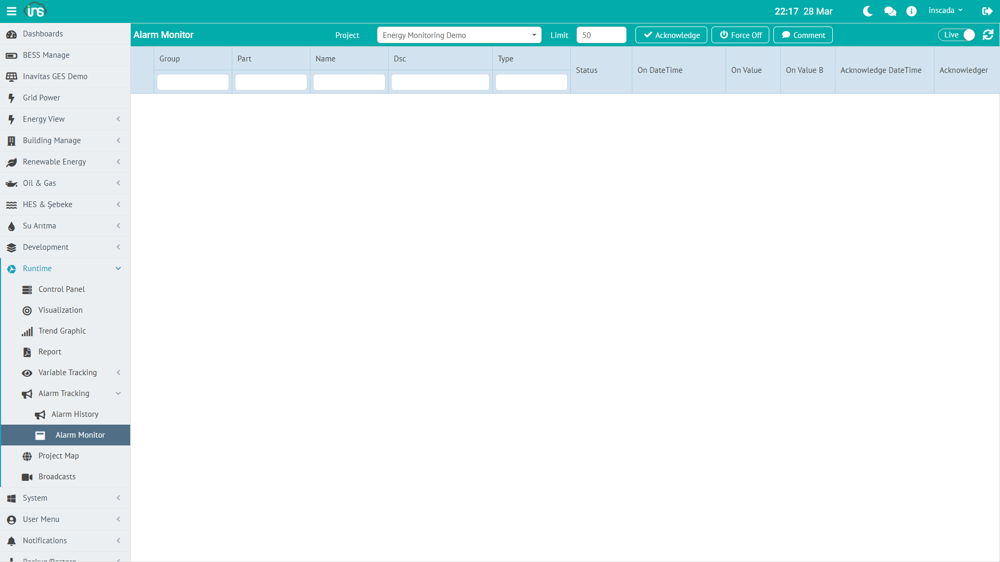

The alarm system detects, records, and reports abnormal conditions on variable values. Alarms are organized into groups, and each group is bound to a project.



## Alarm Group

An alarm group organizes alarm definitions and defines common behavior (scan period, priority, trigger scripts, colors, printer settings).

### Core Fields

| Field | Type | Required | Description |
|-------|------|----------|-------------|
| **name** | String (≤100) | Yes | Group name |
| **dsc** | String (≤255) | No | Description |
| **scanTimeInMillis** | Integer (≥100) | Yes | Alarm check period (ms) |
| **priority** | Short (1-255) | Yes | Priority level |
| **projectId** | String | Yes | Owning project |

### Script Hooks

Script references that run automatically on alarm events — all optional:

| Field | Description |
|-------|-------------|
| **onScriptId** | `RepeatableScript` that runs when the alarm fires |
| **offScriptId** | Script that runs when the alarm clears |
| **ackScriptId** | Script that runs when the alarm is acknowledged |

### Colors

Alarm monitor row background colors:

| Field | State |
|-------|-------|
| **onNoAckColor** | ON + not acknowledged |
| **onAckColor** | ON + acknowledged |
| **offNoAckColor** | OFF + not acknowledged |
| **offAckColor** | OFF + acknowledged |

Colors are stored as hex `#RRGGBB`.

### Printer Integration

Alarm events can be pushed directly to a network printer:

| Field | Description |
|-------|-------------|
| **printerIp** | Printer IP |
| **printerPort** | Printer port (0-65535) |
| **printWhenOn** | Print on fire |
| **printWhenOff** | Print on clear |
| **printWhenAck** | Print on acknowledge |
| **printWhenComment** | Print on comment |

---

## Alarm Types

Each alarm row in the `Alarm` table carries a `DiscriminatorValue` selecting one of three subtypes.

### Common Alarm Fields

| Field | Type | Description |
|-------|------|-------------|
| **name** | String (≤100) | Alarm name (unique within the project) |
| **dsc** | String (≤255) | Description |
| **groupId** | String | Owning alarm group |
| **delay** | Integer (ms, ≥0) | Debounce — must hold condition this long before firing |
| **isActive** | Boolean | Whether this definition is active |
| **part** | String (≤100) | Equipment / line code — used for filtering and reporting |
| **onTimeVariableId** | String | Optional variable that receives the ON timestamp |
| **offTimeVariableId** | String | Optional variable that receives the OFF timestamp |

### Analog Alarm (`type = "Analog"`)

Threshold monitoring on numeric variables. Additional fields:

| Field | Description |
|-------|-------------|
| **variableId** | Monitored variable |
| **setPointValue** | Reference value (for deviation computation) |
| **highHighValue** | Critical-high threshold |
| **highValue** | Warning-high threshold |
| **lowValue** | Warning-low threshold |
| **lowLowValue** | Critical-low threshold |
| **deadband** | Hysteresis (absolute) — delta required before the alarm re-clears |
| **deviationPercentage** | Percent deviation from setPoint |

| Threshold | Example |
|-----------|---------|
| **High-High** | Temperature > 90 °C (critical) |
| **High** | Temperature > 70 °C (warning) |
| **Low** | Pressure < 2 bar (warning) |
| **Low-Low** | Pressure < 1 bar (critical) |

Unused thresholds can be left `null` — they will not be checked. `deadband` prevents chattering.

### Digital Alarm (`type = "Digital"`)

Monitors boolean state changes.

| Condition | Behavior |
|-----------|----------|
| Value `true` | Alarm fires (ON) |
| Value `false` | Alarm clears (OFF) |

Examples: motor fault contact, door-open contact, e-stop button.

### Custom Alarm (`type = "Custom"`)

Arbitrary alarm condition expressed as JavaScript. Truthy → ON, falsy → OFF.

```javascript
// Alarm that depends on two variables
var power = ins.getVariableValue("ActivePower_kW").value;
var temp = ins.getVariableValue("Temperature_C").value;
return power > 500 && temp > 70;
```

---

## Alarm Lifecycle

The actual alarm status (`FiredAlarmStatus` enum) is two-valued:

```
ON (fired)  →  OFF (cleared)
```

Acknowledge, comment, and force-off are **not** part of the status — they are separate fields / operations:

| Field / Operation | Meaning |
|-------------------|---------|
| **acknowledgeTime / acknowledgedBy** | Set when an operator acknowledges; the alarm may still be ON |
| **commentTime / comment / commentedBy** | Set when an operator adds a comment |
| **forceOff operation** | Drives the alarm OFF artificially, even if the condition still holds |
| **offTime** | Set when the condition naturally clears |

### Operator Actions

| Action | Who | Changes status? |
|--------|-----|-----------------|
| **Acknowledge** | Operator | No (`acknowledgeTime` fills in) |
| **Comment** | Operator | No (`comment` + `commentTime` fill in) |
| **Force Off** | Operator | Yes (ON → OFF) |
| Natural clear | System | Yes (`offTime` fills in) |

### Color State Matrix

| Status | Ack | Typical Color |
|--------|-----|---------------|
| **ON** | Not acked | Red blinking (`onNoAckColor`) |
| **ON** | Acked | Red solid (`onAckColor`) |
| **OFF** | Not acked | Yellow (`offNoAckColor`) |
| **OFF** | Acked | Normal (`offAckColor`) |

---

## Alarm Monitoring

### Alarm Monitor



Live view of active alarms. From this screen the operator can:
- View alarms
- Acknowledge
- Comment
- Force off

### Alarm Tracking

Historical alarm query by date range. Each `FiredAlarm` record has:

| Field | Description |
|-------|-------------|
| `alarmName` | Which alarm fired |
| `onTime` | Fire timestamp |
| `offTime` | Clear timestamp (null = still ON) |
| `status` | `On` / `Off` |
| `acknowledgedBy` / `acknowledgeTime` | Who acknowledged, when |
| `comment` / `commentedBy` / `commentTime` | Comment metadata |
| `variableValue` | Variable value at fire time |
| `part` | Inherited from the definition — usable as a filter |

---

## Scripting Alarms

```javascript
// Last N fired alarms (exclude OFFs)
var last10 = ins.getFiredAlarms(0, 10);
// → [{ alarmName: "...", status: "On", onTime: ..., ... }, ...]

// Last N including OFFs
var last10Full = ins.getFiredAlarms(0, 10, true);

// History in date range (last 24h)
var end = ins.now();
var start = ins.getDate(end.getTime() - 86400000);
var history = ins.getFiredAlarmsByDate(start, end, true, 100);

// Currently-fired alarms
var current = ins.getCurrentAlarms(false);

// Disable an alarm group (maintenance mode)
ins.deactivateAlarmGroup("Temperature_Alarms");
// Re-enable after maintenance
ins.activateAlarmGroup("Temperature_Alarms");

// Operator actions — take a FiredAlarmDto
var latest = ins.getFiredAlarm(0);
if (latest) {
    ins.acknowledgeAlarm(latest);
    ins.commentAlarm(latest, "Maintenance team notified");
    // ins.forceOffAlarm(latest); // to force clear
}

// Alarm / group status
var groupStatus = ins.getAlarmGroupStatus("Temperature_Alarms");
// → "Active" or "Not Active"
```

:::note[Changes from JDK11]
JDK21 simplified the API method names: `getLastFiredAlarms(...)` → **`getFiredAlarms(...)`** and `getLastFiredAlarmsByDate(...)` → **`getFiredAlarmsByDate(...)`**. Also `acknowledgeAlarm` / `forceOffAlarm` / `commentAlarm` now accept a `FiredAlarmDto` instead of primitive parameters.
:::

Details: [Alarm API →](/docs/en/jdk21/platform/scripts/server/alarm-api/) | [REST API Reference →](/docs/en/jdk21/api/reference/) (see Alarm Group, Analog Alarm, Digital Alarm, Custom Alarm, Fired Alarm, Alarm Controller Facade groups)
