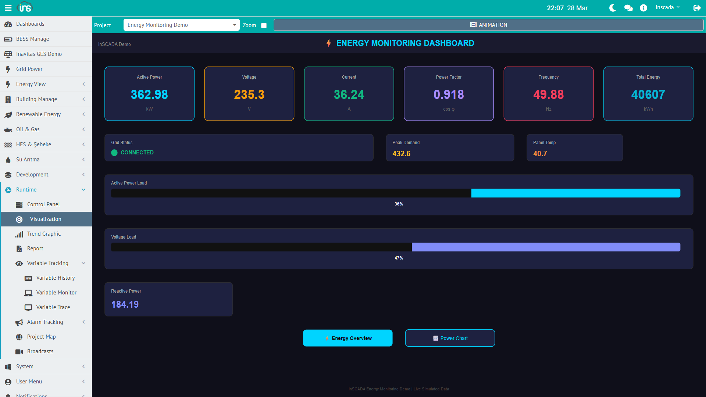
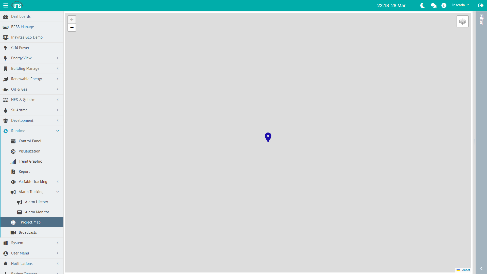

inSCADA is a SCADA platform designed to collect, process, visualize, and automate data from field devices. It runs as a single Spring Boot application — all components live in one process.

## Data Hierarchy

All data in inSCADA is organized at two levels: **Space** and **Project**. Some components are shared across all projects in a space; others belong to a single project.

```
Space (Workspace)
│
├── [Space-level — shared across projects]
│   ├── Custom Menu
│   ├── Dashboard
│   ├── Expression
│   └── Symbol (SVG symbol library)
│
└── Project
    │
    ├── [Communication]
    │   └── Connection
    │       └── Device
    │           └── Frame
    │               └── Variable
    │
    ├── [Monitoring & Alarm]
    │   ├── Alarm Group
    │   │   ├── Analog Alarm
    │   │   ├── Digital Alarm
    │   │   └── Custom Alarm
    │   └── Trend
    │       └── Trend Tag
    │
    ├── [Automation]
    │   ├── Script
    │   └── Data Transfer
    │
    ├── [Visualization]
    │   ├── Animation (SVG screen)
    │   └── Faceplate (reusable SVG component)
    │
    └── [Reporting]
        └── Report (classic + Jasper)
```

:::note[Space vs. Project]
**Custom Menu**, **Dashboard**, **Expression** and **Symbol** are defined at the space level — shared by all projects in the same space. Everything else belongs to a project.
:::

### Space

A space is the top-level isolation unit. Each space has its own projects, users, and configuration. Different spaces are fully independent of one another.

Typical uses:
- **Customer isolation** — one space per customer
- **Environment separation** — dev, test, production
- **Departmental split** — energy, water, building automation

### Project

A project represents a facility, site, or logical unit. A space can contain many projects. Every component of a project (connections, alarms, scripts, screens, etc.) runs within the project's scope.

Example projects:
- "Ankara Factory" — a production plant
- "GES-01" — a solar power plant
- "Building-A HVAC" — the HVAC system of a building

Projects can carry optional latitude/longitude coordinates and be shown on the map view.

### Connection

A connection is a communication channel to a field device or system. Each connection uses one protocol.

**Supported protocols:**

| Group | Protocol | Client | Server / Slave |
|------|------------|--------|----------------|
| **Industrial** | Modbus TCP / UDP / RTU Over TCP | ✓ | ✓ (per transport) |
| | S7 | ✓ | — |
| | EtherNet/IP | ✓ | — |
| | Fatek TCP / UDP | ✓ | — |
| **Power / Utility** | DNP3 | ✓ | ✓ |
| | IEC 60870-5-104 | ✓ | ✓ |
| | IEC 61850 | ✓ | ✓ |
| **Open Standard** | OPC UA | ✓ | ✓ |
| | OPC DA | ✓ | — |
| | OPC XML | ✓ | — |
| | MQTT | ✓ | — |
| **Internal** | LOCAL (simulation / internal computation) | — | — |

Every connection can be started and stopped independently. Status values: **Connected**, **Disconnected**.

:::note[Sidecar protocols]
**BACnet** and **KNX** are not bundled into the inSCADA platform — they run as separate Node.js gateways and integrate with inSCADA over REST/WebSocket. See [BACnet](/docs/en/jdk21/protocols/bacnet/), [KNX](/docs/en/jdk21/protocols/knx/).
:::

### Device

A device represents a physical or logical unit over a connection. A Modbus TCP connection, for example, may address several slave devices.

### Frame

A frame is a block of data read from a device. Each frame defines an address range and a read period.

| Parameter | Description |
|-----------|-------------|
| **Start address** | First address to read |
| **Quantity** | Number of registers / points to read |
| **Period** | Read interval (ms) |

:::tip
Frames are critical for performance. Packing consecutive addresses into one frame is far cheaper than reading them one at a time.
:::

### Variable

The variable is the core data unit on the platform. A temperature reading, a motor status, a meter value — each one is a variable.

Core fields:

| Field | Description |
|---------|-------------|
| **Name** | Unique within the project |
| **Type** | Float, Integer, Boolean, String |
| **Unit** | Engineering unit (°C, kW, bar, V, A, …) |
| **Scaling** | Raw → engineering conversion (engZeroScale, engFullScale) |
| **Logging** | Historical logging mode |
| **Expression** | Optional computed-value formula |

#### Scaling

Raw value is linearly converted to engineering value:

```
Engineering = engZeroScale + (raw - rawZeroScale) ×
              (engFullScale - engZeroScale) / (rawFullScale - rawZeroScale)
```

Example: 4-20 mA sensor → 0-100 °C:
- Raw: 4 mA → 0 °C, 20 mA → 100 °C
- engZeroScale=0, engFullScale=100, rawZeroScale=4, rawFullScale=20

#### Logging Types

| Type | Description |
|-----|-------------|
| **No Log** | Not logged |
| **When Changed** | Log on value change |
| **Periodically** | Log at fixed interval (logPeriod seconds) |
| **Threshold** | Log when a threshold is crossed |
| **Expression** | Log decision driven by a user expression |
| **Custom** | Script-driven custom logic |

#### Value Expression

A variable can carry a per-variable compute formula. On every read cycle the formula runs and its result becomes the variable value:

```javascript
// Sine-wave simulation
var t = new Date().getTime() / 1000;
return (Math.sin(t / 60) * 150 + 450).toFixed(2) * 1;
```

---

## Alarm System

### Alarm Group

Alarms are organized into groups. Every alarm group belongs to a project and can be enabled/disabled together.

```
Project
└── Alarm Group (e.g. "Temperature Alarms")
    ├── Analog Alarm: Temperature_C > 60 °C (High)
    ├── Analog Alarm: Temperature_C > 80 °C (Critical)
    └── Analog Alarm: Temperature_C < 10 °C (Low)
```

### Alarm Types

| Type | Description | Parameters |
|-----|-------------|-------------|
| **Analog** | Numeric threshold | setPoint, highHigh, high, low, lowLow |
| **Digital** | Boolean state | ON → alarm, OFF → normal |
| **Custom** | Script-based condition | JavaScript expression |

### Alarm Status (FiredAlarm)

Each triggered alarm is stored as a `FiredAlarm` record. The actual status is two-valued:

```
ON (fired) → OFF (cleared)
```

Acknowledge and comment are **not** part of the status — `acknowledgeTime`, `acknowledgedBy`, `commentTime`, `comment` are separate fields that capture user interaction but do not change the alarm state.

Every alarm event is stored historically: fire time, clear time, who acknowledged, duration.

---

## Script Engine

Scripts are the platform's automation engine. They run server-side on GraalJS (Nashorn compatibility mode) and access all platform data through the `ins.*` API.

### Typical Script Use Cases

| Area | Description | Example |
|------|-------------|---------|
| **Scheduled task** | Periodic or timed execution | Energy calc every 10 s |
| **Variable formula** | Value derivation | Derive a 3rd variable from two others |
| **Alarm condition** | Custom alarm logic | Condition across multiple variables |
| **Data integration** | REST calls | Pulling weather data from an API |
| **Reporting** | Automatic reports | Emailing a daily PDF report |
| **Notification** | Event-driven messaging | Sending an SMS on alarm fire |

### Schedule Types

| Type | Behavior |
|-----|----------|
| **Periodic** | Runs every X milliseconds |
| **Daily** | Runs once a day at a fixed time |
| **Once** | Runs once and stops |
| **None** | Manual / API trigger only |

Details: [Script Engine →](/docs/en/jdk21/platform/scripts/)

---

## Visualization Components

### Animation (SVG screen) — Project-level



SVG-based interactive SCADA screens. Variable values are rendered live: color changes, movement, numeric readouts, on/off controls.

### Faceplate — Project-level

Reusable SVG components. A motor, valve, or pump that appears many times can be defined once as a faceplate and embedded in multiple animations.

### Symbol (SVG symbol library) — Space-level

An SVG symbol library shared across the space. Animations and faceplates in any project can reference its symbols.

### Dashboard — Space-level

Used to combine data from several projects into a single board. Defined at the space level so it can span projects.

### Trend Chart — Project-level

Time-series charts of one or more variables (Trend Tag). Used for historical inspection and comparison.

### Custom Menu — Space-level

Builds a per-role navigation menu. Different menus can be assigned to different roles: operator sees only monitoring screens, manager sees reports, engineer sees configuration.

### Report — Project-level

Produces PDF and Excel output. Two report flavors:
- **Classic Report** — inSCADA's built-in table/template format
- **Jasper Report** — JasperReports files (.jrxml / .jasper) for rich layouts

Both can be scheduled, emailed, or written to disk.

### Expression (shared formula) — Space-level

Shared compute formulas used by many variables or alarms. Centralizes repeated formulas so they can be maintained in one place.

### Project Map



A GIS view with project locations. Each project marker shows live values, alarm status, and connection health in a popup.

---

## Database Layers

inSCADA uses three data tiers, each tuned for a different data shape:

### PostgreSQL — Configuration Database

Project definitions, variable settings, users, roles, alarm definitions, script code — all platform configuration data lives here. This data changes rarely, is relational, and prioritizes consistency.

Schema migrations are managed by Flyway; the default schema name is `inscada`.

### InfluxDB — Time-Series Database

Variable history, alarm history, event logs, login attempts — everything with a timestamp lives here. This data is write-heavy, rarely updated, and queried by time range.

Each measurement (variable value, alarm, event log) can have its own retention policy; retention durations are configured at the InfluxDB layer — inSCADA does not hard-code a default.

### Redis — Live-Value Cache

The **latest value** of every variable is held in Redis. `ins.getVariableValue()` and the REST API read from the cache — they do not touch InfluxDB.

Benefits:
- Sub-millisecond live-value reads
- Thousands of variables can be read concurrently
- Web UI and scripts see the same current value

Redis also backs script global objects, session tokens, and rate-limit counters.

---

## Data Flow

From field device to web screen:

```
┌─────────┐    ┌──────────┐    ┌─────────┐    ┌────────┐    ┌────────┐
│  Field  │───▶│Connection│───▶│  Frame  │───▶│  Raw   │───▶│ Scale  │
│  Device │    │(Protocol)│    │  (Read) │    │  Value │    │        │
└─────────┘    └──────────┘    └─────────┘    └────────┘    └───┬────┘
                                                                │
                    ┌───────────────────────────────────────────┘
                    │
                    ▼
              ┌──────────┐    ┌──────────┐    ┌──────────┐
              │  Redis   │───▶│ InfluxDB │    │  Alarm   │
              │ (Cache)  │    │(History) │    │  Checks  │
              └────┬─────┘    └──────────┘    └──────────┘
                   │
          ┌────────┼────────┐
          ▼        ▼        ▼
     ┌────────┐┌────────┐┌────────┐
     │  Web   ││ Script ││  REST  │
     │   UI   ││ Engine ││   API  │
     └────────┘└────────┘└────────┘
```

1. **Field device** — PLC, RTU, sensor, meter, etc.
2. **Connection** — attaches to the device using the configured protocol
3. **Frame read** — the address block is polled at the frame period
4. **Raw value** — the data returned by the device
5. **Scaling** — raw → engineering conversion (if configured)
6. **Cache (Redis)** — the current value is written to Redis
7. **Logging (InfluxDB)** — based on the logging type, a history point is written
8. **Alarm checks** — alarm definitions are evaluated
9. **Consumption** — Web UI (WebSocket/SSE), Script Engine, and REST API all read from the same cache

### Write Flow (command dispatch)

```
UI / Script / API → cache update → Connection → protocol write → Field device
```

When `ins.setVariableValue()` (or the UI) writes a value, the command is forwarded over the connection to the field device.

---

## Multi-Space (Multi-Tenant)

```
inSCADA Instance
├── Space: "energy"
│   ├── Project: "GES-01"
│   ├── Project: "GES-02"
│   └── Project: "RES-01"
│
├── Space: "buildings"
│   ├── Project: "HQ"
│   └── Project: "Warehouse"
│
└── Space: "water"
    ├── Project: "Treatment Plant"
    └── Project: "Pump Stations"
```

Each space:
- Has its own set of projects
- Has its own user permissions
- Is data-isolated from other spaces

Users can have access to multiple spaces and switch between them mid-session. REST calls pass the target space via the `X-Space` header.

---

## Cluster Mode (optional)

Activating the `cluster` Spring profile runs inSCADA in multi-node (active-follower) mode. Entity replication, InfluxDB sync, and file-system replication ride RabbitMQ; leader election is done over JGroups. A single-node setup does not require the cluster profile.

---

## Access and Ports

Default configuration:

| Port | Use |
|------|-----|
| **8082** | HTTPS — Web UI and REST API (main endpoint) |
| **8083** | HTTPS — Sandbox (isolated origin for custom-HTML widget iframes) |

The application serves over HTTPS only by default; the TLS bundle is configured via `server.ssl.bundle`. No plain-HTTP port is opened by default.

The `follower` profile uses 9082/9083 to separate node01 from node02 locally.

The web UI works in any modern browser, including tablets and phones (responsive). No desktop client install required.

Configuration details: [Configuration →](/docs/en/jdk21/deployment/configuration/)
