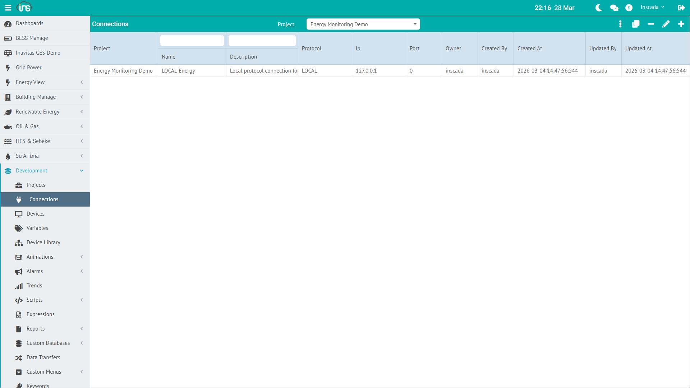

A connection is the communication channel to a field device or system. Each connection uses one protocol and is bound to a project.



## Connection Fields

| Field | Type | Required | Description |
|-------|------|----------|-------------|
| **name** | String | Yes | Connection name (unique within the project) |
| **protocol** | `Protocol` enum | Yes | Communication protocol |
| **ip** | String | Protocol-dependent | Target IP address |
| **port** | Integer | Protocol-dependent | Target port number |
| **dsc** | String (≤255) | No | Description |
| **projectId** | String | Yes | Owning project ID |

Protocol-specific fields (unit id, timeout, polling period, …) are covered in each protocol's configuration page.

## Supported Protocols

| Protocol value | Use Case | Typical Device |
|----------|----------|----------------|
| `Modbus TCP` / `Modbus TCP Slave` | Industrial automation | PLC, energy analyzer, drive |
| `Modbus UDP` / `Modbus UDP Slave` | Low-latency polling | Energy meter |
| `Modbus RTU Over TCP` / `Modbus RTU Over TCP Slave` | Serial ↔ TCP gateway | RTU, serial device |
| `DNP3` / `DNP3 Slave` | Power distribution | RTU, protection relay |
| `IEC 60870-5-104` / `IEC 60870-5-104 Server` | Transmission / distribution | RTU, SCADA gateway |
| `IEC 61850` / `IEC 61850 Server` | Substation automation | IED, protection relay |
| `OPC UA` / `OPC UA Server` | Open standard | PLC, DCS, SCADA |
| `OPC DA` | Windows COM/DCOM | Legacy OPC servers |
| `OPC XML` | HTTP / SOAP | OPC over web services |
| `S7` | Siemens PLC | S7-300, S7-400, S7-1200, S7-1500 |
| `MQTT` | IoT / message broker | Gateway, sensor, broker |
| `EthernetIp` | Rockwell / Allen-Bradley | Logix 5000+ family |
| `Fatek TCP` / `Fatek UDP` | Fatek PLC | FBs, FBe series |
| `LOCAL` | Simulation / internal compute | Internal variable |

The `Slave` / `Server` variants let inSCADA expose itself as a listening endpoint on the given protocol (serving data to remote masters/clients).

Per-protocol details: [Protocols →](/docs/en/jdk21/protocols/)

:::note[Sidecar protocols]
**BACnet** and **KNX** are not bundled into the inSCADA platform — they run as separate Node.js gateway services and integrate over REST/WebSocket. They do not appear as a Protocol value on a Connection.
:::

## Connection Status

`ConnectionStatus` enum:

| Status | Meaning |
|--------|---------|
| **Connected** | Connection is up, data is being read |
| **Disconnected** | Connection is down — either stopped, or the peer is unreachable |

:::note
inSCADA only exposes two values for connection status. A timeout, auth failure, or similar problem puts the connection into `Disconnected`; the failure details are visible in the platform log / event log. There is no separate `Error` status.
:::

## Connection Shape (example)

```json
{
  "id": "abc123",
  "name": "LOCAL-Energy",
  "protocol": "LOCAL",
  "ip": "127.0.0.1",
  "port": 0,
  "projectId": "proj-153",
  "dsc": "Local protocol connection for energy simulation"
}
```

## Starting / Stopping Connections

Connections can be managed from the UI or from scripts. The server-side `ins.*` API:

```javascript
// Query status
var status = ins.getConnectionStatus("LOCAL-Energy");
// → "Connected" or "Disconnected"

// Cycle the connection in the next tick
ins.stopConnection("MODBUS-PLC");
ins.startConnection("MODBUS-PLC");

// Target a connection in another project
ins.stopConnection("GES-02", "MODBUS-PLC");
ins.startConnection("GES-02", "MODBUS-PLC");
```

:::note
The GraalJS sandbox disallows `java.lang.Thread.sleep()` and similar thread primitives. `stopConnection` and `startConnection` are synchronous — no sleep between them is required.
:::

## Updating Connection Parameters

`ins.updateConnection` takes a full `ConnectionResponseDto`. The typical pattern is read-modify-write:

```javascript
var conn = ins.getConnection("MODBUS-PLC");
conn.setIp("192.168.1.100");
conn.setPort(502);

ins.updateConnection("MODBUS-PLC", conn);
```

The same applies to `updateDevice` and `updateFrame`:

```javascript
var device = ins.getDevice("MODBUS-PLC", "slave-1");
device.setUnitId(3);
ins.updateDevice("MODBUS-PLC", "slave-1", device);

var frame = ins.getFrame("MODBUS-PLC", "slave-1", "main-block");
frame.setPeriod(2000);
ins.updateFrame("MODBUS-PLC", "slave-1", "main-block", frame);
```

:::tip
If the update changes a network endpoint, follow the `stopConnection` → update → `startConnection` order. For purely internal settings (e.g. polling period), no restart is needed.
:::

Details: [Connection API →](/docs/en/jdk21/platform/scripts/server/connection-api/) | [REST API Reference →](/docs/en/jdk21/api/reference/) (see Connection Management, Protocol Connection, Protocol Variable, Protocol Template controller groups)
