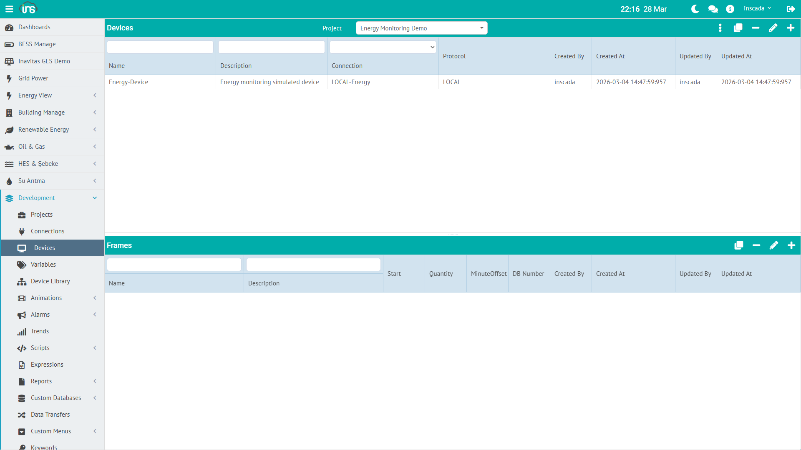

## Device

A device represents a physical or logical unit over a connection. A single connection can host many devices — for example, multiple slaves on a Modbus TCP link.

### Device Fields

Common fields:

| Field | Type | Required | Description |
|-------|------|----------|-------------|
| **name** | String (≤100) | Yes | Device name (unique within the connection) |
| **dsc** | String (≤255) | No | Description |
| **protocol** | `Protocol` | Auto | Inherited from the parent connection |
| **connectionId** | String | Yes | Owning connection ID |
| **config** | Map | Protocol-dependent | Protocol-specific settings (JSONB) |

Fields that appear at the top level of the device JSON come from `config` — inSCADA flattens the DTO. For Modbus the device-level fields are:

| Field | Type | Description |
|-------|------|-------------|
| **scanTime** | Integer (≥100) | Read cycle (ms) |
| **scanType** | `DeviceScanType` | `Periodic` or `Fixed Delay` |
| **stationAddress** | Integer (≥0) | Modbus slave address |

### Scan Type

The `DeviceScanType` enum has two values:

| Value | Behavior |
|-------|----------|
| **Periodic** | Fixed-rate scheduling — the period between cycle starts stays at `scanTime` |
| **Fixed Delay** | Fixed-delay scheduling — `scanTime` is inserted *after* each cycle ends |

### Device JSON (Modbus example)

```json
{
  "id": "abc123",
  "connectionId": "conn-153",
  "protocol": "Modbus TCP",
  "name": "slave-1",
  "dsc": "Energy meter",
  "scanTime": 2000,
  "scanType": "Periodic",
  "stationAddress": 1
}
```

### Scan Time Recommendations

| Scenario | Suggested scanTime |
|---------|-------------------|
| Fast-changing data (power, current) | 1000 – 2000 ms |
| Medium-rate data (temperature, pressure) | 3000 – 5000 ms |
| Slow-changing data (energy meter) | 5000 – 10000 ms |
| Status bits (on/off) | 1000 – 3000 ms |

:::tip
Shorter scanTime means more network traffic. Tune per use case. Each protocol has its own floor (100 ms for Modbus).
:::

:::note
For other protocols (DNP3, IEC-104, OPC UA, S7, …) the device config fields differ. See the protocol-specific docs: [Protocols →](/docs/en/jdk21/protocols/)
:::

---

## Frame

A frame is a block of data read from a device. Each frame defines an address range. Variables live inside frames.

### Frame Fields

Common fields:

| Field | Type | Required | Description |
|-------|------|----------|-------------|
| **name** | String (≤100) | Yes | Frame name |
| **dsc** | String (≤255) | No | Description |
| **deviceId** | String | Yes | Owning device ID |
| **protocol** | `Protocol` | Auto | Inherited from the device |
| **isReadable** | Boolean | Yes | Whether the frame is polled |
| **isWritable** | Boolean | Yes | Whether variables in this frame can be written |
| **scanTimeFactor** | Integer | No | Multiplier on device scanTime (null or 1 → same period) |
| **minutesOffset** | Integer | No | Schedule offset in minutes (e.g. on-the-hour alignment) |
| **config** | Map | Protocol-dependent | Protocol-specific fields (JSONB) |

For Modbus the frame config fields are:

| Field | Type | Description |
|-------|------|-------------|
| **type** | `ModbusFrameType` | Frame type (Coil, DiscreteInput, HoldingRegister, InputRegister) |
| **startAddress** | Integer (0-65535) | First address to read |
| **quantity** | Integer (1-1024) | Number of registers/coils to read |
| **interFrameDelay** | Integer | Delay between frames (ms) |

### Frame JSON (Modbus example)

```json
{
  "id": "frame-703",
  "deviceId": "dev-453",
  "protocol": "Modbus TCP",
  "name": "holding-block",
  "dsc": "Holding registers 0-49",
  "isReadable": true,
  "isWritable": true,
  "scanTimeFactor": null,
  "minutesOffset": null,
  "type": "HoldingRegister",
  "startAddress": 0,
  "quantity": 50
}
```

### Readable / Writable

| Setting | Meaning |
|---------|---------|
| **isReadable = true** | Frame is polled (monitoring) |
| **isWritable = true** | Variables in the frame accept writes (control) |
| Both `true` | Read + write — the most common case |
| **isReadable = false** | Write-only frame (setpoint dispatch) |

### Scan Time Factor

Sets the frame's read period as a multiple of the device scanTime:

- Device scanTime = 2000 ms, frame scanTimeFactor = 3 → frame is polled every 6000 ms
- `null` or `1` → same period as the device

:::tip
Use scanTimeFactor on slow-changing blocks to cut unnecessary network traffic.
:::

---

## Hierarchy Summary

```
Connection: LOCAL-Energy (LOCAL, 127.0.0.1)
└── Device: Energy-Device (scanTime: 2000 ms, Periodic)
    └── Frame: Energy-Frame (readable + writable)
        ├── ActivePower_kW (Float, kW)
        ├── ReactivePower_kVAR (Float, kVAR)
        ├── Voltage_V (Float, V)
        ├── Current_A (Float, A)
        ├── Frequency_Hz (Float, Hz)
        ├── PowerFactor (Float)
        ├── Energy_kWh (Float, kWh)
        ├── Temperature_C (Float, °C)
        ├── Demand_kW (Float, kW)
        └── GridStatus (Boolean)
```

The shape is identical on a Modbus TCP link — the only change is that device- and frame-level protocol-specific fields (stationAddress, type, startAddress, quantity, …) are added.

Reading and updating devices / frames from scripts: [Connection API →](/docs/en/jdk21/platform/scripts/server/connection-api/)
