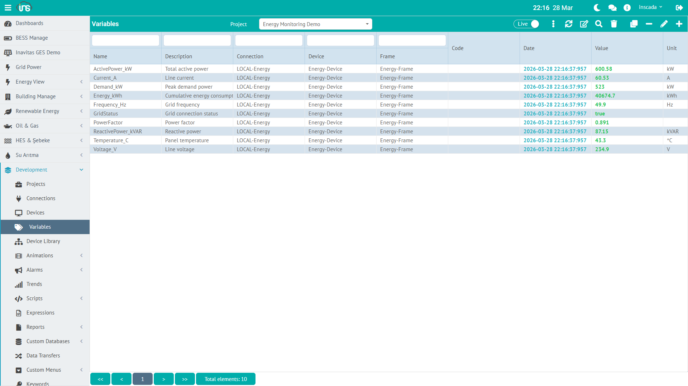

A variable is the core data unit in inSCADA. A temperature reading, a motor status, an energy counter — each one is a variable.



## Variable Fields

Core metadata:

| Field | Type | Required | Description |
|-------|------|----------|-------------|
| **name** | String (≤100) | Yes | Variable name — unique within the project |
| **dsc** | String (≤255) | No | Description |
| **code** | String (≤20) | No | Short technical code (usable in screens) |
| **unit** | String (≤50) | No | Engineering unit (°C, kW, V, A, bar, …) |
| **fractionalDigitCount** | Short | No | Decimal digits shown in rendered value |
| **projectId** | String | Yes | Owning project |
| **frameId** | String | Yes | Owning frame (protocol and device derived from it) |
| **protocol** | `Protocol` | Auto | Inherited from the frame |
| **isActive** | Boolean | Yes | Active / inactive |
| **isWritable** | Boolean | Yes | Writable from outside |

Scaling:

| Field | Type | Description |
|-------|------|-------------|
| **rawZeroScale** | Double | Raw low limit |
| **rawFullScale** | Double | Raw high limit |
| **engZeroScale** | Double | Engineering low limit |
| **engFullScale** | Double | Engineering high limit |

Logging:

| Field | Type | Description |
|-------|------|-------------|
| **logType** | `VariableLogType` | See table below |
| **logPeriod** | Integer (≥1) | Periodic logging interval (s) |
| **logThreshold** | Double | Minimum delta (noise filter) |
| **logMinValue / logMaxValue** | Double | Accepted value band — outside values are dropped |
| **logExpressionCode** | String | Decision code (logType = Expression / Custom) |
| **logExpressionId** | String | Shared Expression reference |
| **keepLastValues** | Boolean | Keep a bounded list of last values in cache (see `ins.getLastVariableValues`) |

Value expression (computed value):

| Field | Type | Description |
|-------|------|-------------|
| **valueExpressionType** | `ExpressionType` | `NONE`, `CUSTOM` or `EXPRESSION` |
| **valueExpressionCode** | String (≤32 767) | Inline code (type = `CUSTOM`) |
| **valueExpressionId** | String | Shared Expression reference (type = `EXPRESSION`) |

Write limits & pulse:

| Field | Type | Description |
|-------|------|-------------|
| **setMinValue / setMaxValue** | Double | Accepted write range |
| **isPulseOn / pulseOnDuration** | Boolean / Integer | ON pulse enabled and length (ms) |
| **isPulseOff / pulseOffDuration** | Boolean / Integer | OFF pulse enabled and length (ms) |

Protocol-specific fields (address, data type, byte/word swap, …) live in the `config` JSONB map and are flattened into the DTO on the wire.

## Data Types

Each protocol has its own data-type enum; the common conceptual mapping:

| Concept | Modbus | OPC UA | Others |
|---------|--------|--------|--------|
| **Float** | Float, Double | Float, Double | available in most |
| **Integer** | Integer, Short, Long, Byte, Unsigned … | Int16/32/64, UInt16/32/64, Byte, SByte | varies |
| **Boolean** | Boolean | Boolean | |
| **String** | String | String | |
| **BCD** | 16/32/64-bit BCD | — | Modbus-only |

Full Modbus list: `Float`, `Double`, `Integer`, `Short`, `Long`, `Byte`, `Unsigned Integer`, `Unsigned Short`, `Unsigned Byte`, `16 BIT BCD`, `32 BIT BCD`, `64 BIT BCD`, `Boolean`, `String`. See the protocol pages for the other enums.

## Variable JSON (Modbus, Holding Register → Float)

```json
{
  "id": "var-23227",
  "name": "ActivePower_kW",
  "dsc": "Total active power",
  "unit": "kW",
  "protocol": "Modbus TCP",
  "projectId": "proj-153",
  "frameId": "frame-703",
  "isActive": true,
  "isWritable": false,
  "fractionalDigitCount": 2,
  "engZeroScale": 0.0,
  "engFullScale": 1000.0,
  "logType": "Periodically",
  "logPeriod": 10,
  "keepLastValues": true,
  "valueExpressionType": "NONE",

  "type": "Float",
  "startAddress": 0,
  "byteSwapFlag": false,
  "wordSwapFlag": true
}
```

The last four fields (`type`, `startAddress`, `byteSwapFlag`, `wordSwapFlag`) are Modbus-specific `config` entries.

---

## Scaling

Raw is converted to engineering via a linear map.

### Formula

```
Eng = engZeroScale + (raw - rawZeroScale) ×
      (engFullScale - engZeroScale) / (rawFullScale - rawZeroScale)
```

### Example: 4-20 mA sensor → 0-100 °C

| Parameter | Value |
|-----------|-------|
| rawZeroScale | 4 (mA) |
| rawFullScale | 20 (mA) |
| engZeroScale | 0 (°C) |
| engFullScale | 100 (°C) |

- Raw: 4 mA → Eng: 0 °C
- Raw: 12 mA → Eng: 50 °C
- Raw: 20 mA → Eng: 100 °C

### Scaling in the Live-Value Response

```json
{
  "value": 359.91,
  "extras": { "raw_value": 606.56 },
  "flags": { "scaled": true }
}
```

`value` is the scaled engineering value; `extras.raw_value` is the raw number.

---

## Logging (History)

Variable values are written to InfluxDB according to `VariableLogType`.

### Logging Types

`VariableLogType` enum — six values:

| Type | Behavior |
|-----|----------|
| **No Log** | Not logged |
| **When Changed** | Log only when the value changes |
| **Periodically** | Log at a fixed interval (`logPeriod` seconds) |
| **Threshold** | Log when the change exceeds `logThreshold` |
| **Expression** | Evaluate the shared Expression referenced by `logExpressionId` — log if truthy |
| **Custom** | Evaluate inline `logExpressionCode` — log if truthy |

### Logging Parameters

| Parameter | Description |
|-----------|-------------|
| **logPeriod** | Periodic logging interval (seconds). `10` = once every 10 s |
| **logThreshold** | Minimum delta (threshold mode or extra filter) |
| **logMinValue / logMaxValue** | Accepted value band — outside values are dropped |
| **keepLastValues** | Keep the latest values list in cache (for `ins.getLastVariableValues(name, n)`) |

### Fractional Digit Count

`fractionalDigitCount` controls how many decimals are rendered:

| Value | Displayed |
|-------|-----------|
| `0` | 350 |
| `1` | 350.5 |
| `2` | 350.48 |
| `3` | 350.483 |

---

## Value Expression

A variable can carry its own JavaScript formula. On each read cycle the formula runs and its result becomes the variable value.

### Expression Types

`ExpressionType` enum:

| Type | Meaning |
|-----|---------|
| **NONE** | No expression — the raw (scaled) value is used |
| **CUSTOM** | Run the inline code in `valueExpressionCode` |
| **EXPRESSION** | Resolve the shared Expression via `valueExpressionId` — pulled from the space-level formula pool |

### Example: Simulation

```javascript
// Sine wave (ActivePower_kW)
var t = new Date().getTime() / 1000;
return (Math.sin(t / 60) * 150 + 450 + Math.random() * 30).toFixed(2) * 1;
```

### Example: Unit Conversion

```javascript
// Fahrenheit → Celsius (raw is available as 'value')
return ((value - 32) * 5 / 9).toFixed(1) * 1;
```

### Example: Conditional Logic

```javascript
// Efficiency from two variables
var input = ins.getVariableValue("Input_kW").value;
var output = ins.getVariableValue("Output_kW").value;
if (input > 0) {
    return ((output / input) * 100).toFixed(1) * 1;
}
return 0;
```

---

## Pulse Behavior

Boolean variables can use pulse mode:

| Field | Description |
|-------|-------------|
| **isPulseOn** | ON pulse enabled |
| **pulseOnDuration** | ON pulse length (ms) |
| **isPulseOff** | OFF pulse enabled |
| **pulseOffDuration** | OFF pulse length (ms) |

Pulse mode is used for momentary commands — e.g. a motor-start button: writing ON flips the bit, and after `pulseOnDuration` the system automatically writes OFF. The operator does not need to clear the bit manually.

---

## Write Limits

| Field | Description |
|-------|-------------|
| **setMinValue** | Minimum writable value |
| **setMaxValue** | Maximum writable value |

When set, writes outside this range are rejected from both the API and scripts. Use it to prevent operator error.

---

## Scripting Variables

```javascript
// Read a live value
var val = ins.getVariableValue("ActivePower_kW");
// → { value: 359.91, extras: { raw_value: 606.56 }, dateInMs: ... }

// Bulk read
var vals = ins.getVariableValues(["ActivePower_kW", "Voltage_V", "Current_A"]);

// Write
ins.setVariableValue("Temperature_C", { value: 55.0 });

// Last N values (for variables with keepLastValues = true)
var last100 = ins.getLastVariableValues("Temperature_C", 100);

// Query logged (historical) values
var start = ins.getDate(ins.now().getTime() - 3600000); // last 1 hour
var history = ins.getLoggedValues("Temperature_C", start, ins.now());
```

Details: [Variable API →](/docs/en/jdk21/platform/scripts/server/variable-api/) | [REST API Reference →](/docs/en/jdk21/api/reference/) (Variable Value Controller, Protocol Variable Controller groups)
