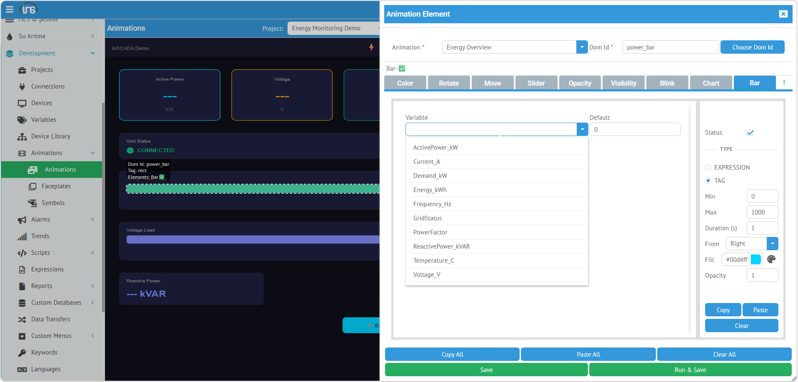
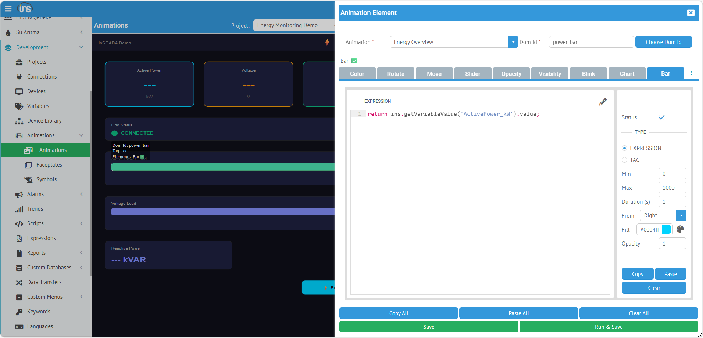

**Bar**, bir SVG dikdörtgeninin yüksekliğini veya genişliğini değere orantılı olarak değiştirir. Tank seviyesi, ilerleme çubuğu, yük göstergesi, enerji barı gibi gösterimlerde kullanılır.

## Kullanım

| Alan | Değer |
|------|-------|
| **Type** | Bar |
| **Uygun SVG Öğeleri** | `<rect>` |

## Yapılandırma Tipleri

### TAG — Değişken Seçimi (Kod Yazmadan)

En hızlı kullanım. Listeden değişken seçilir, bar otomatik olarak değere göre büyür/küçülür.



TYPE bölümünden **TAG** seçildiğinde değişken listesi ve bar yapılandırma alanları açılır.

#### Temel Alanlar

| Alan | Açıklama |
|------|----------|
| **Variable** | Açılır listeden değişken seçimi |
| **Default** | Değer okunamadığında gösterilecek varsayılan bar boyutu |

#### Bar Ayarları

| Alan | Açıklama |
|------|----------|
| **Min** | Minimum değer (bu değerde bar boş / sıfır boyut) |
| **Max** | Maksimum değer (bu değerde bar tam dolu) |
| **Direction** | Bar'ın büyüme yönü |
| **Gradient** | İşaretlenirse bar dolgusu gradient (renk geçişi) olarak gösterilir |

#### Direction (Yön) Seçenekleri

| Değer | Açıklama | Kullanım |
|-------|----------|----------|
| **Right** | Soldan sağa büyür | Yatay ilerleme çubuğu |
| **Left** | Sağdan sola büyür | Ters yönlü yatay bar |
| **Up** | Aşağıdan yukarı büyür | Tank seviyesi, dikey gösterge |
| **Down** | Yukarıdan aşağı büyür | Ters yönlü dikey bar |

### EXPRESSION — JavaScript ile Hesaplama

Birden fazla değişkenden hesaplama veya özel dönüşüm gerektiğinde kullanılır.



TYPE bölümünden **EXPRESSION** seçildiğinde JavaScript kod editörü açılır. `return` ile döndürülen sayısal değer, Min-Max aralığına göre bar boyutuna dönüştürülür.

Expression modunda da **Min**, **Max**, **Direction** ve **Gradient** alanları aynı şekilde kullanılır.

#### Örnek: Doğrudan Değer

```javascript
return ins.getVariableValue('ActivePower_kW').value;
```

#### Örnek: Yüzdeye Dönüştürme

```javascript
var val = ins.getVariableValue("ActivePower_kW").value;
var maxPower = 1000;
return (val / maxPower) * 100; // 0-100 arası yüzde
```

#### Örnek: İki Değişkenin Oranı

```javascript
var output = ins.getVariableValue("Output_kW").value;
var input = ins.getVariableValue("Input_kW").value;
if (input > 0) return (output / input) * 100; // verimlilik %
return 0;
```

---

## Kullanım Örnekleri

### Yatay İlerleme Çubuğu

```xml
<svg viewBox="0 0 400 60">
  <!-- Arka plan -->
  <rect x="10" y="20" width="300" height="20" fill="#e0e0e0" rx="3"/>
  <!-- İlerleme barı -->
  <rect id="progress_bar" x="10" y="20" width="0" height="20" fill="#2196F3" rx="3"/>
</svg>
```

- TYPE: TAG, Variable: `PowerFactor`
- Min: `0`, Max: `1`, Direction: **Right**

### Dikey Tank Seviyesi

```xml
<svg viewBox="0 0 100 250">
  <!-- Tank çerçevesi -->
  <rect x="20" y="10" width="60" height="200" fill="none" stroke="#666" stroke-width="2"/>
  <!-- Seviye barı -->
  <rect id="tank_level" x="22" y="210" width="56" height="0" fill="#3498db"/>
</svg>
```

- TYPE: TAG, Variable: `Tank_Level`
- Min: `0`, Max: `100`, Direction: **Up**

:::tip
Bar animasyonu, SVG rect öğesinin `width` veya `height` özniteliğini değere orantılı olarak ayarlar. Yönüne göre `x` veya `y` koordinatı da otomatik güncellenir — rect'in sabit kalan kenarı yerinde kalır.
:::
