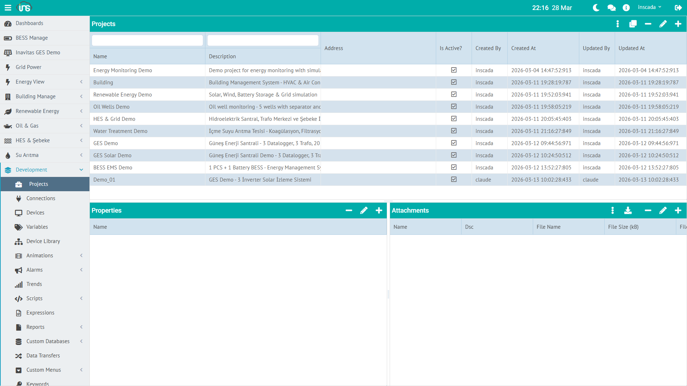

Proje, inSCADA'daki temel organizasyon birimidir. Bir tesis, saha veya mantıksal birim temsil eder. Tüm bağlantılar, değişkenler, alarmlar, script'ler ve ekranlar bir projeye bağlıdır.



## Proje Alanları

| Alan | Tip | Zorunlu | Açıklama |
|------|-----|---------|----------|
| **name** | String (≤100) | Evet | Proje adı — space içinde benzersiz, oluşturulduktan sonra değiştirilemez |
| **dsc** | String (≤255) | Hayır | Açıklama |
| **isActive** | Boolean | Evet | Proje aktif/pasif durumu |
| **address** | String (≤255) | Hayır | Tesis adresi (serbest metin) |
| **latitude** | Double | Hayır | GIS harita enlemi |
| **longitude** | Double | Hayır | GIS harita boylamı |
| **iconFileId** | String | Hayır | Proje simgesi (yönetilen dosya sisteminden) |
| **properties** | String (JSON, ≤32 767) | Hayır | Ek özellikler — JSON formatlı serbest alan |

## Proje Durumu

REST API `/api/projects/{id}/status` ya da UI'daki durum paneli projenin her bir bileşen tipi için çalışma durumunu döner:

```json
{
  "connectionStatuses":  { "conn-id-1": "Connected" },
  "scriptStatuses":      { "script-id-1": "Scheduled", "script-id-2": "Not Scheduled" },
  "dataTransferStatuses":{ "dt-id-1": "Scheduled" },
  "reportStatuses":      { "rep-id-1": "Not Scheduled" },
  "alarmGroupStatuses":  { "ag-id-1": "Active" }
}
```

### Durum Değerleri

| Bileşen | Enum | Olası Değerler |
|---------|------|----------------|
| **Connection** | `ConnectionStatus` | `Connected`, `Disconnected` |
| **Script** | `ScriptStatus` | `Scheduled`, `Not Scheduled` |
| **Data Transfer** | `DataTransferStatus` | `Scheduled`, `Not Scheduled` |
| **Report** | `ReportStatus` | `Scheduled`, `Not Scheduled` |
| **Alarm Group** | `AlarmStatus` | `Active`, `Not Active` |

:::note
Script ve Data Transfer için `Scheduled` "zamanlayıcıya bağlı" anlamına gelir — gerçek anda çalıştığını değil, periyodunda tetiklenmek üzere kuyruğa alındığını gösterir. O anda çalışan bir script'i tespit etmek için `ins.isScriptRunning(name)` kullanılır (Script API'de).
:::

## Proje Yapısı

Bir proje oluşturulduktan sonra içine eklenen bileşenler:

```
Project: "Energy Monitoring Demo"
├── Connection: LOCAL-Energy (LOCAL protokol)
│   └── Device: Energy-Device
│       └── Frame: Energy-Frame
│           ├── Variable: ActivePower_kW
│           ├── Variable: Voltage_V
│           ├── Variable: Current_A
│           └── ... (10 değişken)
├── Script: Chart_ActiveReactivePower
├── Script: Test_LoggedValues
├── Animation: (SVG ekranlar)
├── Trend: (grafik tanımları)
├── Alarm Group: (alarm tanımları)
└── Report: (rapor tanımları)
```

Space seviyesindeki bileşenler (Dashboard, Custom Menu, Expression, Symbol) projenin bir parçası **değildir** — aynı space içindeki tüm projelerden erişilebilirler.

## Proje Haritası

Projelere `latitude` / `longitude` atanırsa, **Project Map** ekranında harita üzerinde görselleştirilebilir:

| Alan | Örnek |
|------|-------|
| **latitude** | 37.9 |
| **longitude** | 32.5 |

Harita üzerinde her proje noktası tıklandığında popup ile anlık durum bilgisi (bağlantı durumu, aktif alarmlar) gösterilir.

## Script ile Proje Yönetimi

Server-side script'lerde `ins.*` API üzerinden proje ile etkileşim:

```javascript
// Space içindeki tüm projeleri getir
var projects = ins.getProjects();

// Yalnızca aktif projeleri getir
var activeProjects = ins.getProjects(true);

// Script'in çalıştığı projeyi getir
var current = ins.getProject();

// Başka bir projenin konumunu güncelle
ins.updateProjectLocation("GES-02", 37.9, 32.5);

// Mevcut projenin konumunu güncelle
ins.updateProjectLocation(41.0082, 28.9784);
```

`getProjects()` ve `getProject()`, her proje için `ProjectResponseDto` döner — yukarıdaki alanların tümü okunabilir (name, dsc, isActive, address, latitude, longitude, iconFileId, properties).

Detaylı API: [Project API →](/docs/tr/jdk21/platform/scripts/server/project-api/) | [REST API Reference →](/docs/tr/jdk21/api/reference/) (sidebar'da Project Controller grubuna bakın)
